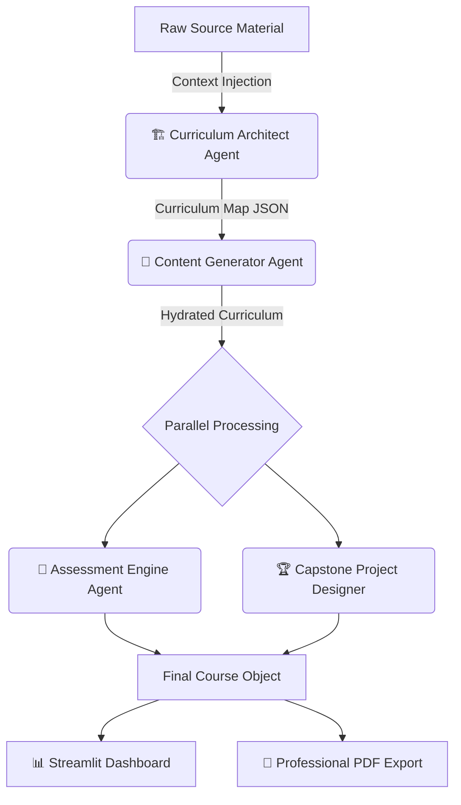

<p align="center">
  
</p>

<div align="center">

# 🏛️ Course Architect: Enterprise-Grade AI Curriculum Engine

**Turn fragmented notes into pedagogically sound, production-ready course architectures in seconds.**

[](https://www.python.org/)
[](https://streamlit.io/)
[](https://groq.com/)
[](https://llama.meta.com/)
[](https://github.com/py-pdf/fpdf2)

---

[Features](#-key-features) • [Architecture](#-multi-agent-system-architecture) • [Pedagogical Foundation](#-pedagogical-foundation) • [Installation](#-quick-start-guide) • [Deployment](#-cloud-deployment)

</div>

## 📄 Executive Summary

**Course Architect** is a sophisticated multi-agent AI framework designed to solve the "blank page" problem for educators, corporate trainers, and content creators. By leveraging specialized LLM agents coordinated in a sequential pipeline, the system transforms raw source material—research papers, lecture transcripts, or unstructured notes—into a comprehensive, ready-to-teach course architecture.

Unlike simple prompt wrappers, Course Architect implements a **hierarchical generation strategy**, ensuring that high-level learning objectives are consistently propagated down to lesson-level content, assessments, and final projects.

---

## ✨ Key Features

### 🏢 Orchestrated Agent Pipeline
- **Agent 1: The Architect** — Designs the high-level curriculum map, module hierarchy, and cognitive prerequisites.
- **Agent 2: The Instructor** — Deconstructs the curriculum to write deep-dive lesson content based on Gagne’s Nine Events.
- **Agent 3: The Assessor** — Generates cognitive evaluations (MCQs, scenarios, and open-ended queries) with detailed scoring rubrics.
- **Agent 4: The Project Lead** — Designs industry-aligned capstone projects that prove mastery of the course outcomes.

### 🎨 Premium "Claude-Inspired" UX
- Clean, minimalist light-theme interface built for focus.
- **Typography:** Using *Newsreader* (Serif) for authority and *Inter* (Sans) for modern readability.
- **Brand Colors:** A curated palette featuring **Terracotta Accent (`#D97757`)** and **Deep Navy (`#0F172A`)**.

### 📄 Enterprise PDF Documentation
- Generates a fully-branded, 10+ page course specification document.
- Includes a professional cover page, modular chapters, shaded content bars, and styled rubric tables.

---

## 🏛️ Multi-Agent System Architecture

Course Architect utilizes a **Linear Chaining Pattern** where state is passed and refined between specialized agents to maximize coherence and reduce hallucinations.



### 🛠️ Technical Deep Dive
- **Inference Engine:** Powered by **Groq** for sub-second response times using **Llama 3.1 8B**.
- **Context Management:** Implements aggressive token compression and "Lightweight Curriculum" passing to handle large course architectures within standard TPM limits.
- **PDF Engine:** Custom-built `fpdf2` wrapper with support for Unicode sanitization and professional typography.

---

## 🎓 Pedagogical Foundation

Course Architect doesn't just "generate text"; it follows established instructional design principles:

1. **Constructivist Alignment:** Ensures learning outcomes directly match the difficulty of assessments and projects.
2. **Gagne’s Events of Instruction:** Lesson content is structured to stimulate recall, provide guidance, and elicit performance.
3. **Scaffolding:** Prerequisites and module goals are used to build a logical progression from foundational concepts to advanced application.

---

## 🚀 Quick Start Guide

### Prerequisites
- Python 3.9+
- Groq API Key ([Get one here](https://console.groq.com))

### Installation

```bash
# 1. Clone the repository
git clone https://github.com/PriyanshuCP42/Course_Architect_Agent.git
cd Course_Architect_Agent

# 2. Setup environment
python -m venv venv
source venv/bin/activate  # Windows: venv\Scripts\activate

# 3. Install dependencies
pip install -r requirements.txt

# 4. Configure API Key
echo "GROQ_API_KEY=your_key_here" > .env

# 5. Run the Engine
streamlit run app.py
```

---

## 🌐 Cloud Deployment

### ☁️ Streamlit Community Cloud (Free)
1. Fork this repo to your GitHub account.
2. Connect your GitHub to [share.streamlit.io](https://share.streamlit.io).
3. Select this repo and click **Deploy**.
4. **CRITICAL:** Go to `Settings > Secrets` and add:
   ```toml
   GROQ_API_KEY = "your_groq_api_key"
   ```

### 🚆 Railway / Render
- **Build Command:** `pip install -r requirements.txt`
- **Start Command:** `streamlit run app.py --server.port $PORT --server.address 0.0.0.0`
- **Envs:** Add `GROQ_API_KEY` to your service environment variables.

---

## 📁 Project Structure

```text
Course_Architect_Agent/
├── app.py              # Main Entry Point & Streamlit UI
├── agents.py           # Multi-Agent Logic & LLM Prompts
├── pdf_generator.py    # Professional PDF Export Engine
├── constants.py        # Design System & Style Tokens
├── requirements.txt    # Production Dependencies
├── assets/             # Brand Assets (Banners, Icons)
└── .env.example        # Configuration Template
```

---

## 🛠️ Technology Stack

<p align="left">
  
  
  
  
  
</p>

- **Inference Engine:** Sub-second response times using Groq's LPU architecture.
- **Frontend Logic:** Reactive state management via Streamlit session states.
- **Agent Coordination:** Hierarchical state propagation through JSON schema enforcement.
- **Document Rendering:** Multi-threaded PDF generation with custom styling tokens.

---

## 🤝 Contributing

We welcome contributions from the community!
1. **Fork** the project.
2. **Create** your Feature Branch (`git checkout -b feature/NewFeature`).
3. **Commit** your changes (`git commit -m 'Add NewFeature'`).
4. **Push** to the Branch (`git push origin feature/NewFeature`).
5. **Open** a Pull Request.

---

## 📜 License

This project is licensed under the **MIT License**. See the `LICENSE` file for details.

---

<div align="center">
  <p>Built by <strong>PriyanshuCP42</strong> with ❤️ and AI.</p>
  
</div>
