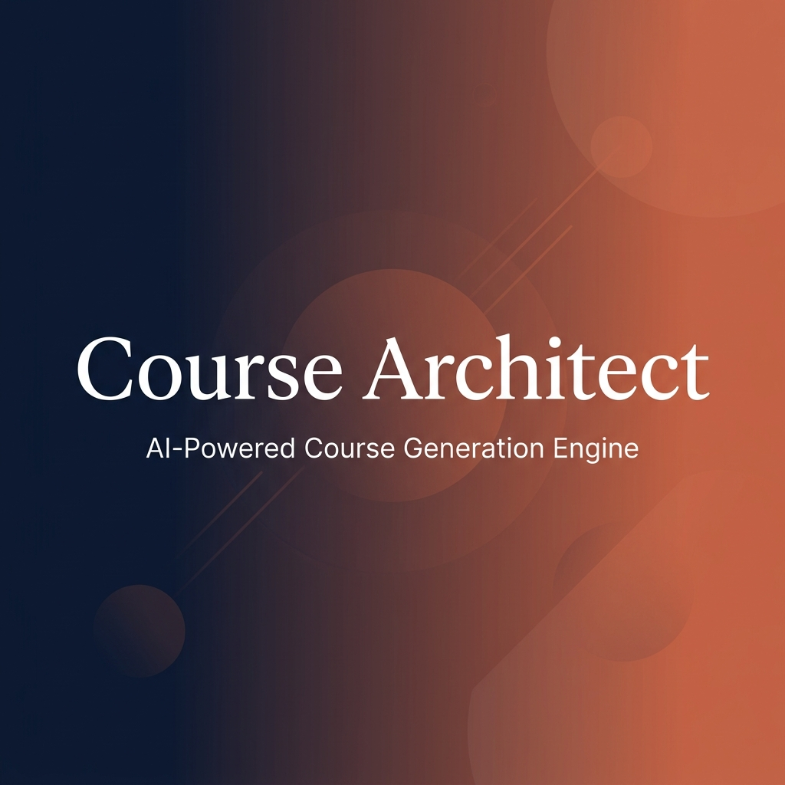

<p align="center">
  
</p>

<div align="center">

# 🏛️ Course Architect: Enterprise-Grade AI Curriculum Engine

**Revolutionizing instructional design by transforming fragmented notes into pedagogically sound, classroom-ready course architectures in seconds.**

[](https://www.python.org/)
[](https://streamlit.io/)
[](https://groq.com/)
[](https://llama.meta.com/)
[](https://github.com/py-pdf/fpdf2)
[](https://opensource.org/licenses/MIT)

---

[Executive Summary](#-executive-summary) • [Key Features](#-key-features) • [Architecture](#-multi-agent-system-architecture) • [Design System](#-premium-design-system) • [Installation](#-quick-start-guide) • [Cloud Deployment](#-cloud-deployment)

</div>

## 📄 Executive Summary

**Course Architect** is a state-of-the-art multi-agent AI framework engineered to eliminate the manual overhead of course creation. By orchestrating specialized Large Language Model (LLM) agents in a synchronized pipeline, the system synthesizes unstructured source material—transcripts, research papers, or raw notes—into a high-fidelity, production-grade course documentation suite.

Unlike generic AI generators, Course Architect employs **Instructional Design Intelligence**, ensuring that every module, lesson, and assessment is pedagogically aligned with the user's target audience and learning objectives.

---

## ✨ Key Features

### 🏢 Orchestrated Multi-Agent Swarm
*   **📐 The Curriculum Architect:** Analyzes source material to build a logical module hierarchy, determining cognitive load and prerequisites.
*   **📖 The Content Specialist:** Deconstructs curriculum nodes into detailed lesson plans using **Gagne’s Nine Events of Instruction**.
*   **🧪 The Assessment Lead:** Generates diverse evaluation sets (MCQs, scenario-based, open-ended) with comprehensive scoring keys.
*   **🏗️ The Project Director:** Architects resume-worthy capstone projects with technical requirements, milestones, and professional rubrics.

### 🎨 Premium "Claude-Inspired" UI/UX
*   **Minimalist Aesthetic:** Clean, light-themed interface designed for cognitive clarity.
*   **Dynamic Rendering:** Real-time generation feedback and interactive tab-based navigation.
*   **Accessibility First:** High-contrast typography and responsive layouts for seamless cross-device usage.

### 📄 Enterprise PDF Documentation
*   Professional 10+ page course specification export.
*   Themed formatting with accent bars, modular headers, and professional tables.
*   Unicode-safe sanitization for flawless document rendering.

---

## 🏛️ Multi-Agent System Architecture

Course Architect uses a **Sequential State Propagation** pattern. Each agent receives the "Course State" and enriches it with specialized data before handing it to the next agent.

```mermaid
graph TD
    A[Raw Source Material] -->|Context Injection| B(🏗️ Curriculum Architect Agent)
    B -->|Curriculum Map JSON| C(📖 Content Generator Agent)
    C -->|Hydrated Curriculum| D{Parallel Orchestration}
    D --> E(🧪 Assessment Engine Agent)
    D --> F(🏆 Capstone Project Designer)
    E --> G[Unified Course Object]
    F --> G
    G --> H[📊 Streamlit Dashboard]
    G --> I[📄 Professional PDF Export]
    G --> J[🖼️ PPTX Slide Generator (Beta)]
```

### 🧠 Design Patterns
*   **Chain-of-Thought (CoT):** Agents are prompted to "reason" through the curriculum structure before outputting JSON.
*   **Context Compression:** Automated truncation of source material to fit within LLM context windows while preserving semantic core.
*   **Schema Enforcement:** Strict JSON validation ensures 100% reliability in UI rendering.

---

## 🎨 Premium Design System

The platform is built on a proprietary design language inspired by modern AI interfaces:

| Token | Value | Description |
|:---|:---|:---|
| **Accent Color** | `#D97757` | Warm Terracotta/Clay for active states and primary CTAs. |
| **Primary Font** | `Inter` | Clean, geometric sans-serif for body and metadata. |
| **Headings** | `Newsreader` | Elegant serif typography for a professional "Published" feel. |
| **Card System** | `12px Radius` | Subtle 1px borders with soft shadows for content isolation. |
| **Page Base** | `#FAFAFA` | Neutral off-white to reduce eye strain during long sessions. |

---

## 🛠️ Technology Stack (Latest Version)

<p align="left">
  
  
  
  
  
</p>

*   **Inference Engine:** Powered by **Groq LPU Architecture** for 500+ tokens/sec performance.
*   **Base Reasoning:** **Meta Llama 3.1 8B** (Instant) for high-accuracy JSON generation.
*   **Frontend Logic:** **Streamlit 1.56** for reactive UI and session state management.
*   **PDF Core:** **FPDF2 2.8** for lightweight, high-performance document rendering.

---

## 🚀 Quick Start Guide

### Prerequisites
*   Python 3.10 or higher
*   Groq API Key from [console.groq.com](https://console.groq.com)

### Installation

```bash
# 1. Clone & Enter
git clone https://github.com/PriyanshuCP42/Course_Architect_Agent.git
cd Course_Architect_Agent

# 2. Dependencies
pip install -r requirements.txt

# 3. Environment Config
# Create a .env file and add your key:
echo "GROQ_API_KEY=your_key_here" > .env

# 4. Launch
streamlit run app.py
```

---

## 🌐 Cloud Deployment

### ☁️ Streamlit Community Cloud (Recommended)
1. Fork the repository.
2. Deploy via the Streamlit dashboard.
3. Add `GROQ_API_KEY` to **Advanced Settings > Secrets**.

### 🐳 Docker Deployment
```bash
docker build -t course-architect .
docker run -p 8501:8501 -e GROQ_API_KEY=your_key course-architect
```

---

## 🤝 Contributing

We welcome contributions to the agentic pipeline! 
1. Fork the Project
2. Create your Feature Branch (`git checkout -b feature/AmazingFeature`)
3. Commit your Changes (`git commit -m 'Add some AmazingFeature'`)
4. Push to the Branch (`git push origin feature/AmazingFeature`)
5. Open a Pull Request

---

## 📜 License

Distributed under the **MIT License**. See `LICENSE` for more information.

---

<div align="center">
  <p>Built with ❤️ by <strong>PriyanshuCP42</strong></p>
  <p>
    <a href="mailto:priyanshuiitian2023@gmail.com">
      
    </a>
    <a href="https://github.com/PriyanshuCP42">
      
    </a>
  </p>
</div>
